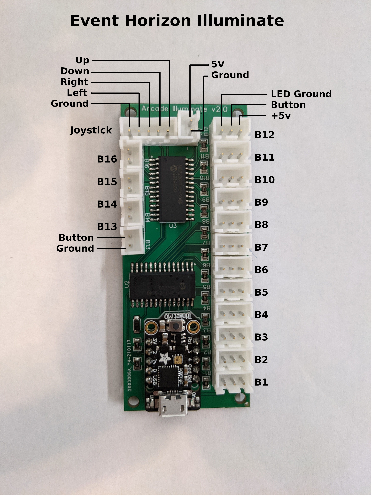
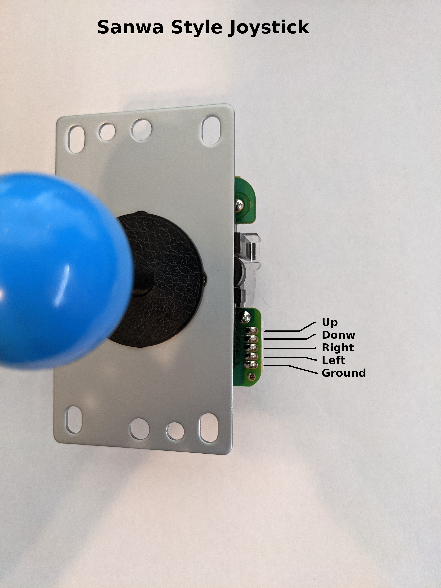
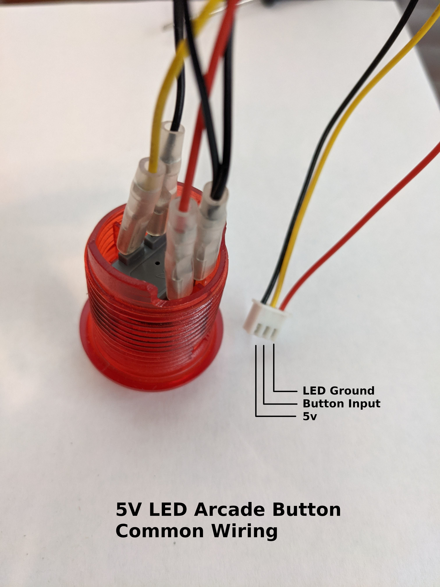
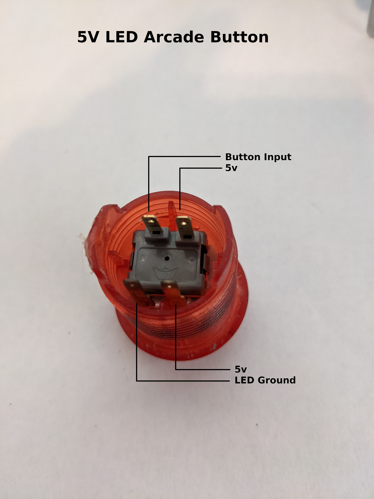
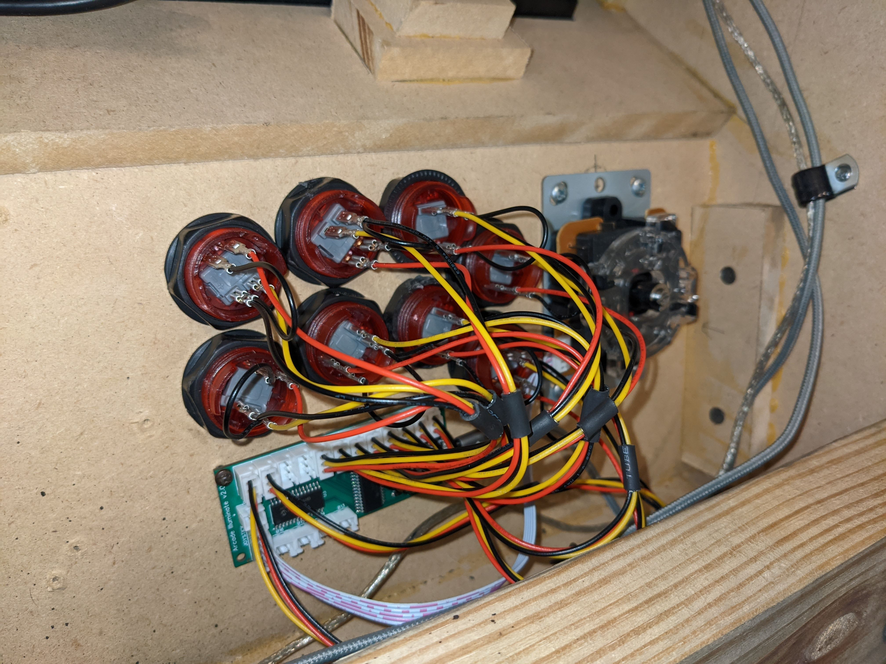
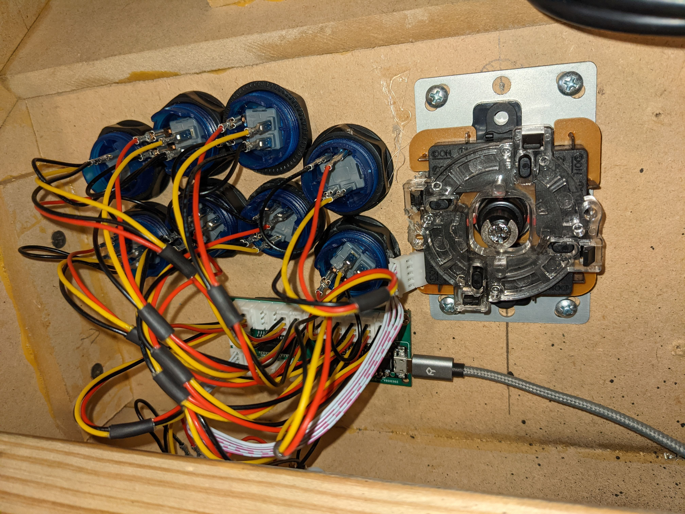

 # Assemble A New Board
 It's as simple as ordering a ready-to-go PCB from JLC-PCB, and soldering in the JST Connectors and Trinket M0 board.  I opted to solder the Trinket M0 Directly to the board. 
 
 If you prefer to etch your own board, you can access my [Schematic and PCB layout on OSHWLab](https://oshwlab.com/shaneapowell/arcadeilluminatev3)

## Order from JLCPCB
I have ready-to-go Gerber, BOM and PNP files that can be used on [JLCPCB.com](https://jlcpcb.com/).  I used these to build my batch of 10. All 10 came out perfectly.
- [Gerber .zip file](docs/pcb_gerber.zip)
- [BOM .csv file](docs/pcb_bom.csv)
- [PickNPlace .csv file](docs/pcb_pnp.csv)

## Parts Needed
- [Event Horizon Circuit Board](https://oshwlab.com/shaneapowell/arcadeilluminatev3) I had them built and assembled by JLCPCB.  The only parts I had to solder in myself were the JST connectors, and the Trinket M0.
- [Adafruit Trinket M0](https://www.adafruit.com/product/3500) & Micro USB cable
- 12x B3B-XH JST thru-hole [Digikey #455-2231-ND](https://www.digikey.com/en/products/detail/jst-sales-america-inc/B3B-XH-AM(LF)(SN)/1651029)
- 5x B2B-XH JST thru-hole [Digikey #455-2273-ND](https://www.digikey.com/en/products/detail/jst-sales-america-inc/B2B-XH-AM(LF)(SN)/1016630)
- 1x B5B-XH JST thru-hole [Digikey #455-2239-ND](https://www.digikey.com/en/products/detail/jst-sales-america-inc/B5B-XH-AM(LF)(SN)/1651037)

Before from JLCPCB on the Left - After on the Right

 # Pins
 
 ## Event Horizon
 

 ## Joystick JST 5-pin (Sanwa)
 This is the joystick I have. The pins on the 5 pin connector on the joystcik are connected this way. This is the default firmware used on an EventHorizon board.
 - Pin 1 = Up
 - Pin 2 = Down
 - Pin 3 = Right
 - Pin 4 = Left
 - Pin 5 = Ground

 
## Joystcik JST 5-pin (Seimitsu)
If you have a joysitck with the 5-pin connector configured this way, you can still use an Event Horizon board, but you'll need to correctly orient your 5-pin cable, and use the Seimitsu EventHorizon firmware.
Details TBA

## Buttons
Most Zero-Delay joystick and button kits indicate this wiring for "Always On" scenarios.  The Black wire is a common 5v, the yellow wire is the button signal, and the red-wire is the LED Ground wire.  This wiring is used by an Event Horizon board.  When connecting the wires to the button, it is critical that the wires are connected as shown.  Specifically, the red and black wires must be connected in this way or the LEDs will fail to operate.

# Installed

